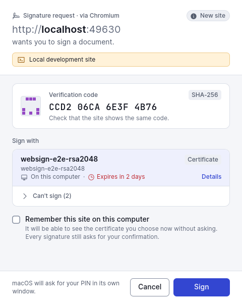
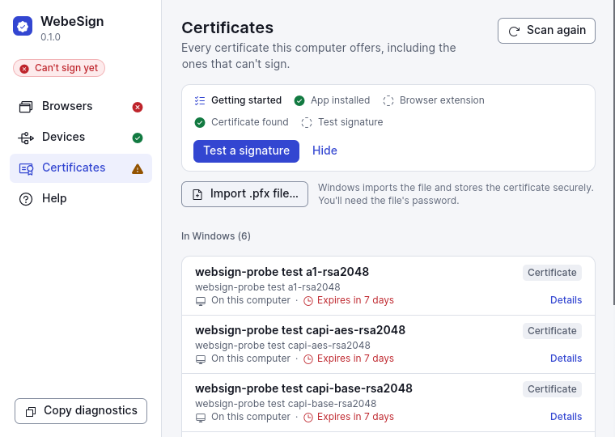
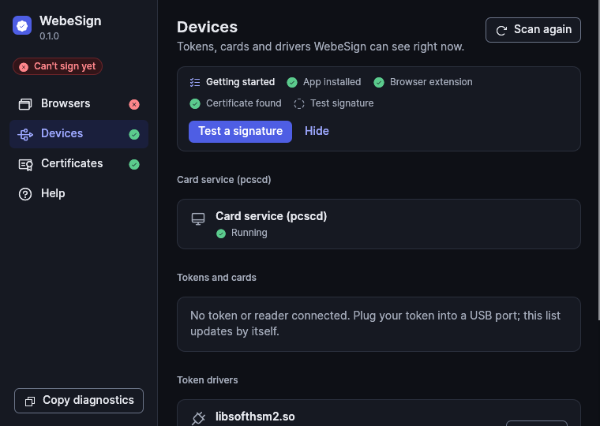

<div align="center">


# WebeSign

**Use your smart card, USB token, or OS certificate to sign on any website.**<br>
Works with Chrome, Edge, Firefox, Opera, Brave and Safari on Windows, macOS, and Linux.<br>
Free and Open Source for everyone.

[](LICENSE)
[](sdk/LICENSE)
[](LICENSE-CC0)

[Install](docs/install.md) · [Website](https://diagnos-tech.github.io/web-esign/) ·
[For developers](#for-developers) · [Compatibility](docs/compatibility.md) · [Security](SECURITY.md)

</div>

<p align="center">
  <picture>
    <source media="(prefers-color-scheme: dark)" srcset="docs/screenshots/macos/confirm-ready-dark.png">
    
  </picture>
  
  
</p>

> **Status:** working prereleases, not code-signed yet. Store listings, code signing and tests with real
> tokens on every system are in progress: see [`docs/compatibility.md`](docs/compatibility.md) and
> [`docs/plan.md`](docs/plan.md).

## How it works

```
website ──hash──▶ extension ──▶ WebeSign app ──▶ OS key store or token driver
   ▲                           (you confirm)     (signs; the PIN is typed here)
   └──────────── raw signature + certificate ◀──────────────┘
```

1. The **website** prepares the document and sends only its **hash** (a short fingerprint).
2. The **browser extension** passes the request to the **WebeSign app** on your computer.
3. The app opens its own window: who is asking, a **verification code** to compare with the site, and
   the certificate. You choose and confirm.
4. **Windows, macOS or the token driver (PKCS#11) signs.** The raw signature (RSA, or ECDSA r‖s) and your
   public certificate go back to the website, which builds PAdES, CAdES, XAdES or JAdES for any country's
   rules (ICP-Brasil, eIDAS…).

**Your PIN never leaves your computer**: it is typed in the app or in the operating system's own window,
never in a web page or in the extension. Desktop programs use the same app through
[`@websign/desktop`](clients/node/) (Node, Bun, Electron) or [`websign-client`](clients/rust/) (Rust).

## Browsers and systems

| | Windows | macOS | Linux |
|---|---|---|---|
| Chromium family: Chrome, Edge, Brave, Opera | CI end to end (Chromium) | CI end to end (Chromium) | CI end to end (Chromium, 6 distributions) |
| Firefox | built, manual check pending | built, manual check pending | built, manual check pending |
| Safari | — | inside the macOS app (macOS 13+); CI builds and checks the bundle, manual check pending | — |

The extension is built for every browser above and the app registers itself with each one it finds.
CI signs end to end with Chromium and software keys on Windows, macOS, Ubuntu 22.04/24.04, Debian 12,
Fedora 42, Rocky Linux 9 and Arch Linux; browsers CI cannot drive are checked by hand. Results with real
browsers, tokens and smart cards, including what is still untested, are in
[`docs/compatibility.md`](docs/compatibility.md).

**Safari** needs no separate download: its extension ships inside `WebeSign.app`. Until the app is signed by
Apple, Safari loads it only with **Allow unsigned extensions** (a developer setting it turns off on every
quit; [steps](docs/install.md#safari)). Keychain certificates and tokens that work with macOS behave as in
other browsers; tokens with only a PKCS#11 driver may not work from Safari's sandbox.

## Install

Two parts: the **app** and the **browser extension**. Pick your system in
[`docs/install.md`](docs/install.md) or on the [download page](https://diagnos-tech.github.io/web-esign/download.html):

- **Windows** (x64, arm64): PowerShell installer script, or the zip.
- **macOS** (Apple silicon and Intel): installer script, or the universal zip.
- **Linux** (amd64, arm64): `.deb` (Ubuntu, Debian), `.rpm` (Fedora, Rocky Linux), or the installer script
  for any distribution.
- **Extension**: [per-browser steps](docs/install.md#browser-extension) until the store listings are live;
  on macOS, Safari's extension comes with the app.

Prereleases are **not code-signed yet**, so SmartScreen and Gatekeeper warn once; every file is listed
in `SHA256SUMS` and the install scripts verify it ([why](docs/install.md#why-unsigned)).

## For developers

Add signing to a web page with [`@websign/sdk`](sdk/): TypeScript, zero dependencies, under 5 KB.

```ts
import { sign } from "@websign/sdk";

const { signature, certificate } = await sign({
  hash: "SHA-256",
  prepare: async (cert, { hash, algorithm }) => crypto.subtle.digest(hash, signedAttributes(cert.der, algorithm)),
});
```

`prepare` runs after the person picks a certificate, so PAdES and CAdES can put it in the signed
attributes. Errors, installation checks and more: [`sdk/README.md`](sdk/README.md) and
[`docs/architecture/web-api.md`](docs/architecture/web-api.md). Desktop programs:
[`docs/architecture/desktop-api.md`](docs/architecture/desktop-api.md).

## Security and privacy

- **Your consent for everything**: a site sees no certificate until you allow it, and every signature
  opens the app's window, even for sites you remembered. You can revoke sites in the app.
- **Only a hash** leaves the website; the document never does. Keys and PINs stay in the OS or the token.
- **No background service, no network port, no account, no telemetry.** The browser or the calling
  program starts the app when needed. Logs hold no names, ID numbers, serials, digests or PINs.
- **No device list to maintain**: the app asks the operating system or the PKCS#11 driver, not the chip.

Threat model: [`docs/architecture/security.md`](docs/architecture/security.md). Report vulnerabilities
privately as described in [`SECURITY.md`](SECURITY.md).

## Repository

| Folder | What | License |
|---|---|---|
| [`app/`](app/) | The `websign` desktop app (Rust): native messaging host, desktop API, confirmation and diagnostics windows | GPL-3.0-or-later |
| [`extension/`](extension/) | Browser extension linking pages to the app | GPL-3.0-or-later |
| [`safari/`](safari/) | Swift bridge Apple requires for the Safari extension | GPL-3.0-or-later |
| [`sdk/`](sdk/) | `@websign/sdk` for websites | Apache-2.0 |
| [`clients/`](clients/) | `@websign/desktop` (Node) and `websign-client` (Rust) for desktop programs | Apache-2.0 |
| [`crates/`](crates/) | The app's libraries; the protocol and project-settings crates are Apache-2.0 | GPL-3.0-or-later / Apache-2.0 |
| [`devices.json`](devices.json) | Driver hints per device (USB and ATR), community-maintained | CC0-1.0 |
| [`i18n/`](i18n/) | Texts in en, pt-BR, pt-PT, es, fr, it, de | GPL-3.0-or-later OR Apache-2.0 |
| [`site/`](site/) | The website: download, test page, `/activate` | GPL-3.0-or-later |
| [`packaging/`](packaging/), [`scripts/install/`](scripts/install/) | Release artifacts and installers | GPL-3.0-or-later |

The app's GPL does not reach websites or programs that call it: they talk through messages, not
linking, and everything they embed is Apache-2.0. The license includes an additional permission for
app-store distribution ([`LICENSE`](LICENSE)). Provisional names and identifiers all live in
[`project.toml`](project.toml).

## Contributing

Contributions are welcome: code, translations, and above all **compatibility reports** with your token or
card ([how](docs/compatibility.md)). Read [`CONTRIBUTING.md`](CONTRIBUTING.md) first (DCO sign-off
required). Documentation: [`docs/architecture/`](docs/architecture/) (contracts), [`docs/ux.md`](docs/ux.md)
(interface), [`docs/plan.md`](docs/plan.md) (decisions and what remains).
