# Screenshots: macos

Generated by `cargo xtask screenshots`; do not edit.

## confirm

| State | Light | Dark |
|---|---|---|
| choose | 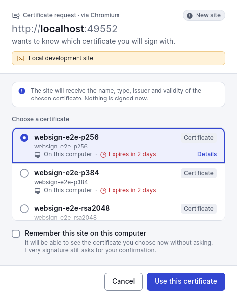 | 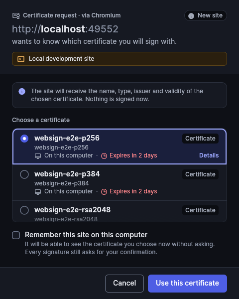 |
| continue-new-site | 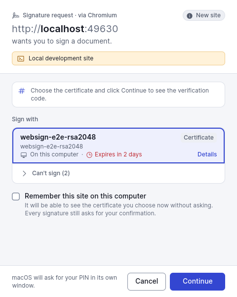 | 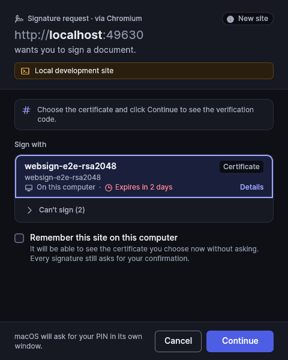 |
| preparing | 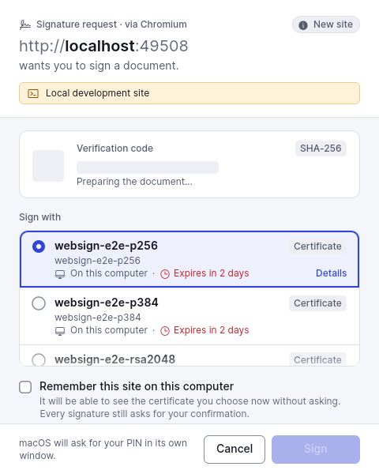 | 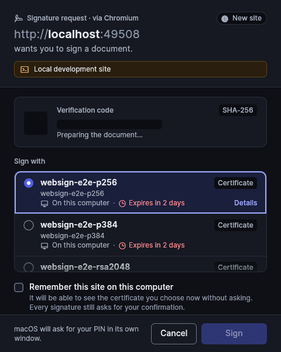 |
| ready |  | 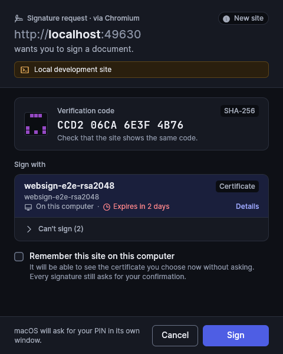 |
| site-cancelled | 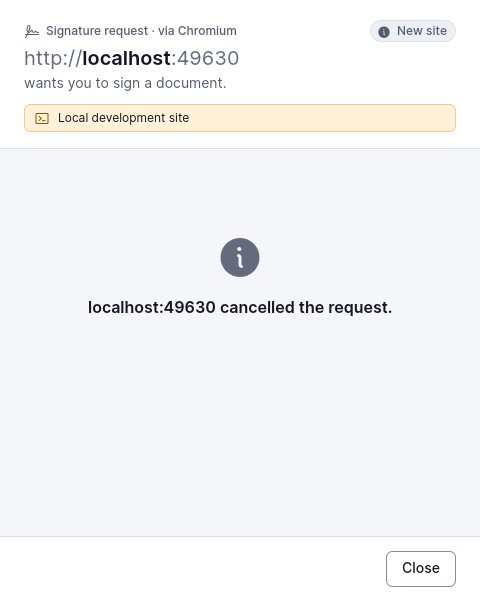 | 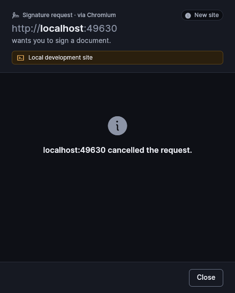 |
| success | 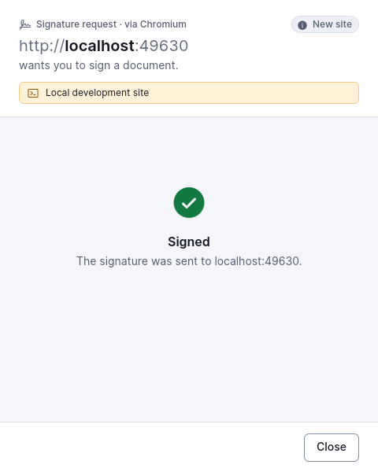 | 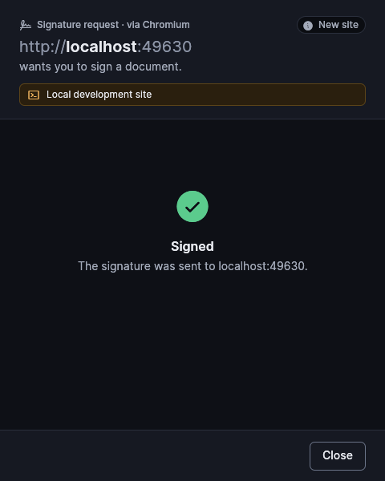 |

## diagnostics

| State | Light | Dark |
|---|---|---|
| browsers | 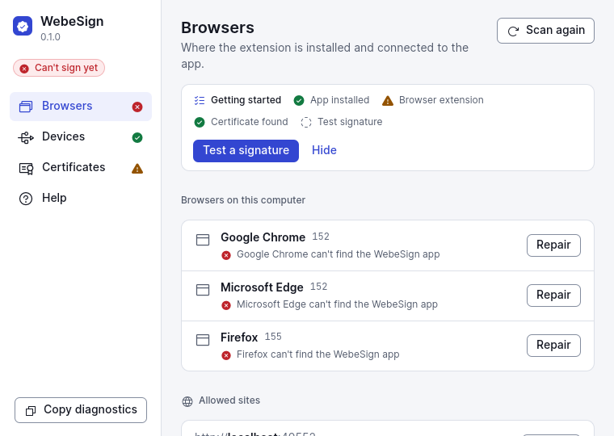 | 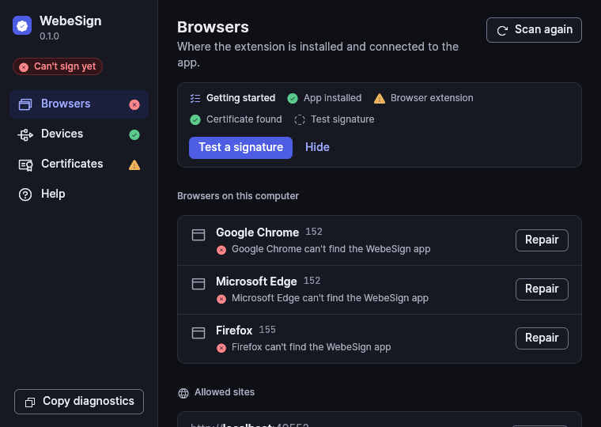 |
| certificates | 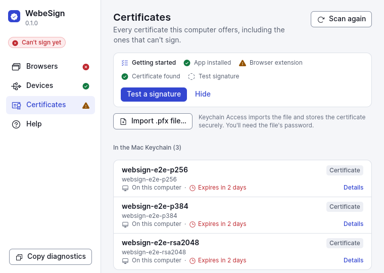 | 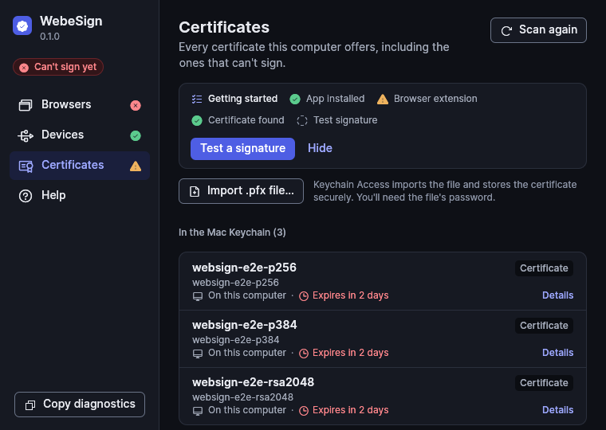 |
| devices | 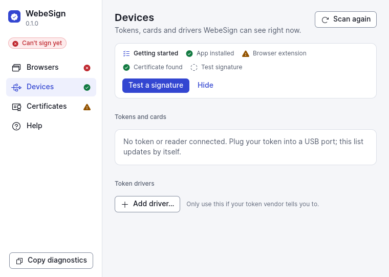 | 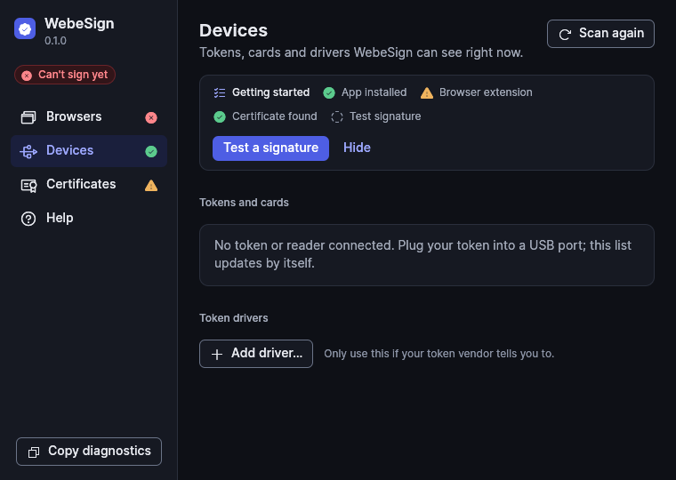 |
| help | 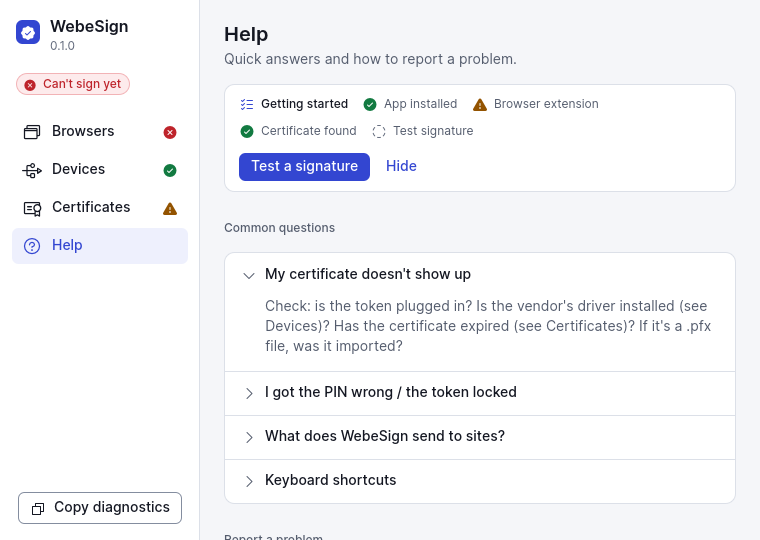 | 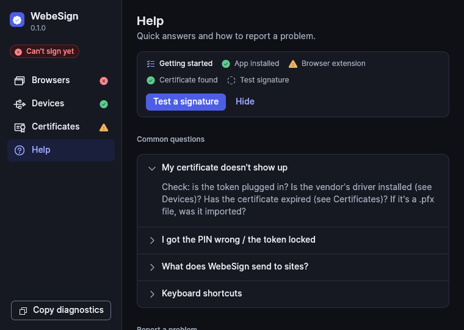 |
